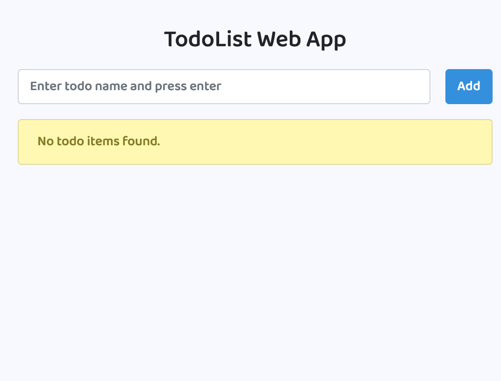
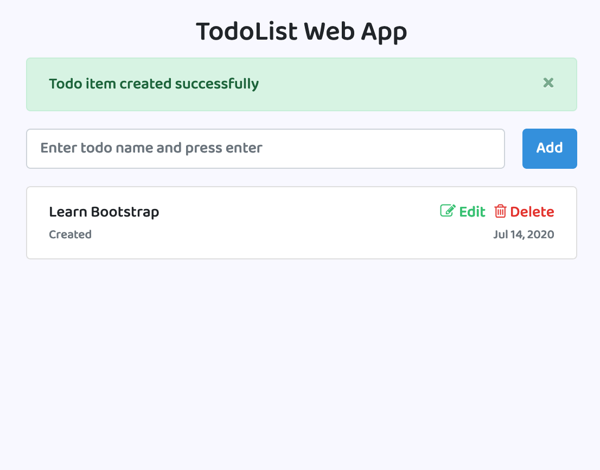
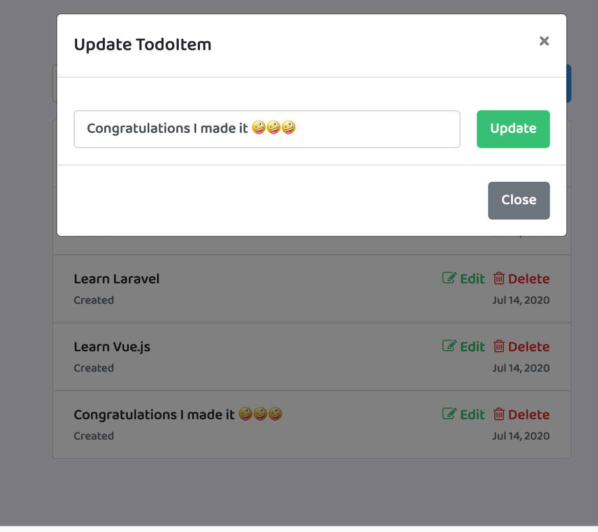
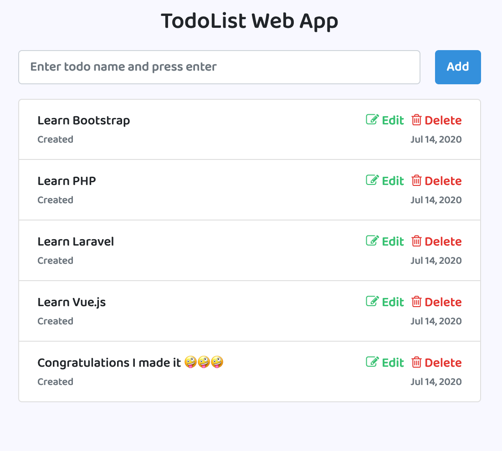

# Laravel Vue.js TodoList Web Application

This is a Web Application leveraging on Vue.js and Laravel to create SPA(Single Page Application) application.

The following must be installed and available on your terminal:
- [x] [composer](https://getcomposer.org/doc/00-intro.md)
- [x] [npm](https://nodejs.org/en/)

### Screenshots
Empty List | With Items
------------ | -------------
 | 
 Edit Modal | Full list
|  | |


### INSTALLATION GUIDE
1. Clone the project
1. ``cd`` to the project and run ``composer install`` on the terminal to install php dependencies
1. copy the `.env-example` file to `.env` file 
1. Migrate your migrations: `php artisan migrate`
1. Generate application encryption key: `php artisan key:generate`
1. Run `npm install && npm run dev` to install node.js dependencies
1. Start your development server and start testing the web app. `php artisan serve --port 8080`
1. Congratulations if you made it!


### INSTALLATION GUIDE USE DOCKER
1. Clone the project
1. ``cd`` to the project and run ``composer install`` on the terminal to install php dependencies
1. copy the `.env-example` file to `.env` file 
1. Run below commands
```
alias sail='[ -f sail ] && bash sail || bash vendor/bin/sail'
sail up -d
sail php artisan migrate
sail php artisan key:generate
sail npm install
sail npm run dev
sail php artisan passport:install
```
1. Congratulations if you made it!
